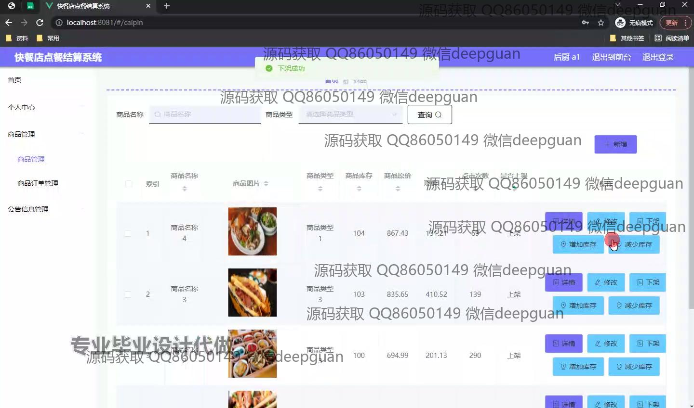

<h1 align="center">快餐店点餐结算系统的设计与实现+vue</h1>

## 简介
快餐店点餐结算系统：角色分为管理员、后厨、员工；支持商品管理、订单管理、用户管理、公告管理等功能，界面简洁高效，便于业务操作与维护。    --计算机毕业设计源码；毕设源码；java毕业设计源码

## 联系方式

<h3 align="center">获取完整代码与数据库文件 + 微信：deepguan QQ: 86050149 QQ群: 783742310</h3>

<h3 align="center">可帮忙远程部署 包运行成功！提供远程部署、修改代码、设计文档指导、代码讲解等服务！</h3>

## 功能介绍（完整见运行截图）
管理员：负责管理商品、订单以及员工信息。拥有商品管理、员工管理、公告管理等功能模块，可以进行商品的详情查看、修改、上架和下架操作，同时管理库存信息，还能查看和处理订单详情。后台提供数据统计与分析功能，支持用户信息的增删改查及密码重置操作。前端界面友好且便于操作，为高效管理快餐店业务提供支持。

员工：主要负责订单的处理与管理。通过系统界面，员工可以查看自己的工作信息、处理顾客订单、上菜以及查看订单的详细信息等。同时可以在个人中心查看并修改自己的个人信息，支持对商品和订单的实时更新操作，确保下单流程的流畅，以及售后的及时响应。

用户：可以注册并登录系统进行点餐和订单管理。用户通过系统前端界面访问商品列表，进行商品搜索、查看商品详情以及添加购物车等操作。用户有权限查看和管理个人信息，通过用户中心查询历史订单与当前购物车，进行订单结算并选择支付方式，使用体验便捷高效。

## 运行截图

本代码来源于网络,仅供学习参考使用!

